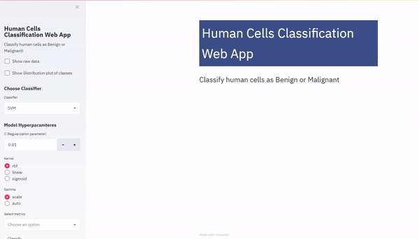

# Human-Cell-Classification-Web-App-with-Streamlit

**This Web App uses different Machine Learning algorithms such as SVM (Support Vector Machines), Logistic Regression and Random Forest to build and train a model using human cell records, and classify cells to whether the samples are benign or malignant. It is built on Python and Streamlit and deployed on Heroku**

### Demo 

[Check out the Deployed Model!!!!!](https://human-cell-classification.herokuapp.com/)

Please give a ⭐ if you liked it.
